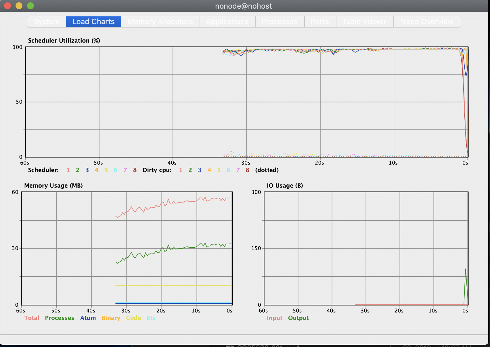

## **Vampire Number Finder | Multiprocessing**


## **Problem definition**

An interesting kind of number in mathematics is vampire number. A vampire number is a composite (Links to an external site.) natural number with an even number of digits, that can be factored into two natural numbers each with half as many digits as the original number and not both with trailing zeroes, where the two factors contain precisely all the digits of the original number, in any order, counting multiplicity. A classic example is: 1260 = 21 x 60.

A vampire number can have multiple distinct pairs of fangs. A vampire numbers with 2 pairs of fangs is: 125460 = 204 × 615 = 246 × 510.

The overall goal of this project is to find all Vampire numbers starting at first upto last using Elixir and the Actor Model to build a good solution to this problem that runs well on multi-core machines.

## **Actor modeling**

In this project, we exclusively used the actor facility in Elixir. In particular, we defined worker actors that are given a range of problems to solve and a boss that keeps track of all the problems and perform the job assignment. Doing so we are trying to achieve utilization of  all the cores.

## **Steps to run code**

1. Open Terminal
2. Navigate to app
3. Run `mix run proj1.exs 100000 200000`

## **Project Design Architecture**

| Modules   | App              | MainSupervisor | BossServer           | ComputationWorker     | Vampire           |
| ----------- | -----------      | -----------    | -----------          | -----------           | -----------       |
| **Functions** | main(arg_1,arg_2)| start_boss     | handle_call(:process)| handle_cast(:compute) | find_vampire(list)|
|             |                  | add_worker     | start_workers(count) |                       |                   |
|             |                  | remove_worker  | distribute_work      |                       |                   |
|             |                  |                | handle_cast(:print)  |                       |                   |

## **Number of worker actors created -**

We used `System.schedulers_online()` to get the no. of logical processors on the system and have spawned that many workers (referred to as `ComputationWorkers`). Besides these we also have a `MainSupervisor`, a supervisor genserver which spawns the the `ComputationWorkers` and a `Boss` genserver . Finally we used the `Boss` to decide the no. of workers to be spawned, distribute work units to the workers. It receives a call back once the tasks are completed and then prints the final output.

For Mishra's PC (4 core CPU with 2 threads each), the no. of workers created = 8

For Prasad's PC (2 core CPU with 2 threads each), the no. of workers created = 4

## **Size of work unit**

The work unit size has been computed dynamically to evenly balance the work load on each worker. We used the `distribute_work/3` function in `BossServer`to delegate the work units.

In cases, where the range starts from small and goes up to a large number, a traditional sequential distribution would result in some workers having relatively easy (small) numbers to work on and other would have large numbers.

To achieve a better load balance, we grouped the range by a modulo function on input and worker count, so that each worker has a good mix of small and large numbers.

For range 100000 to 200000 and 8 workers

Work unit size = 12500

## **Result of `mix run proj1.exs 100000 200000`**
This finds all vampire numbers between 100000 and 200000
```bash
108135 135 801
117067 167 701
124483 281 443
126027 201 627
129775 179 725
156915 165 951
116725 161 725
125433 231 543
133245 315 423
134725 317 425
135837 351 387
136525 215 635
146137 317 461
152685 261 585
156289 269 581
175329 231 759
180225 225 801
180297 201 897
193257 327 591
193945 395 491
197725 275 719
102510 201 510
105210 210 501
105750 150 705
110758 158 701
123354 231 534
126846 261 486
131242 311 422
132430 323 410
140350 350 401
145314 351 414
172822 221 782
173250 231 750
174370 371 470
182250 225 810
182650 281 650
192150 210 915
104260 260 401
105264 204 516
115672 152 761
118440 141 840
120600 201 600
125248 152 824
125460 246 510 204 615
125500 251 500
129640 140 926
135828 231 588
136948 146 938
146952 156 942
150300 300 501
152608 251 608
153436 356 431
156240 240 651
162976 176 926
163944 396 414
186624 216 864
190260 210 906

real    1m36.432s
user    5m14.922s
sys     0m50.031s
```

## **CPU Utilization**

Hardware - Prasad's PC
Physical Cores - 2
Logical Cores - 4
**Ratio (CPU time/Real time) : 3.265**

Hardware - Mishra's PC
Physical Cores - 4
Logical Cores - 8
**Ratio (CPU time/Real time) : (242.72s/34.03s) = 7.132**

CPU Utilization Chart


## **Largest problem solved**

10-digit numbers between 1001795848 and 1001795859.
1 Vampire number found using 8 workers.
